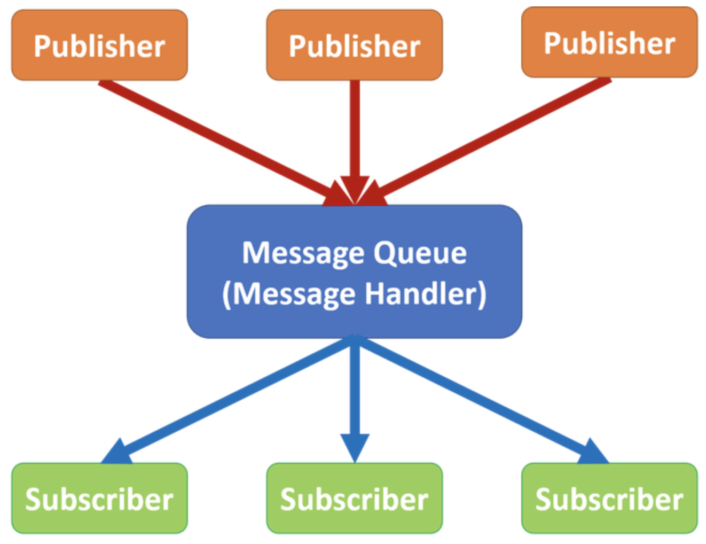

# chatelet 🚉

A pubsub hub for data.gouv.fr.

> Châtelet–Les Halles (French: [ʃɑtlɛ le al]) is a major train hub in Paris and one of the largest underground stations in the world. Opened in 1977, it is the central transit hub for the Île-de-France metropolitan area, connecting three of five RER commuter-rail lines and five of sixteen Métro lines. The hub hosts 750,000 travellers per weekday (493,000 for the RER alone) and platforms separated by up to 800 metres (0.49-mile). It is named after the nearby Place du Châtelet public square and the Forum des Halles, a shopping mall.

_Source: https://en.wikipedia.org/wiki/Châtelet–Les_Halles_

_Image source: https://ravikanthblog.files.wordpress.com/2017/05/pubsub-2.png_

## Usage

`pip install -e ".[test]"`

### API

`make serve`

[See the API doc in markdown here](docs/apidoc.md), or [explore via Swagger UI](https://petstore.swagger.io/?url=https://raw.githubusercontent.com/abulte/chatelet/master/docs/swagger.json).

### Worker

`make work`

## References

- https://resthooks.org

## TODO

- [x] docs (API)
- [x] handle event filtering
    - via JSONPath
- [x] add validation of intent when subscribing (https://resthooks.org/docs/security/)
    - [x] immediate
    - [x] delayed
- [ ] secure publication (shared secret by event?)
- [ ] sign dispatch payload (x-hook-signature)
- [ ] deploy to dokku
- [x] declare events and configuration
- [ ] log publish and dispatch in DB?
- [ ] API on dispatch job status?
